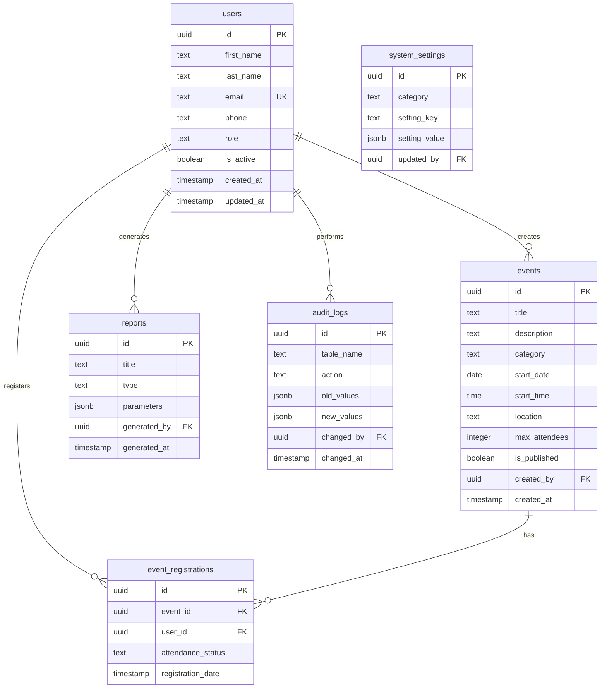
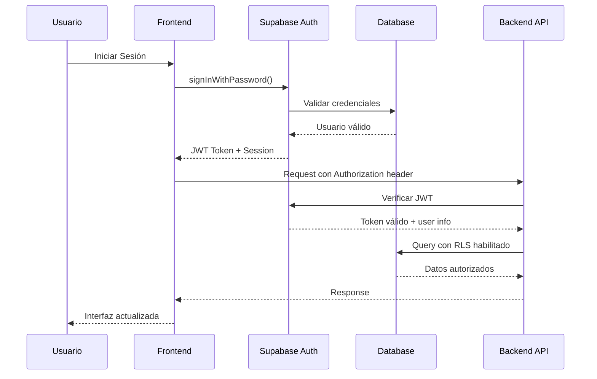
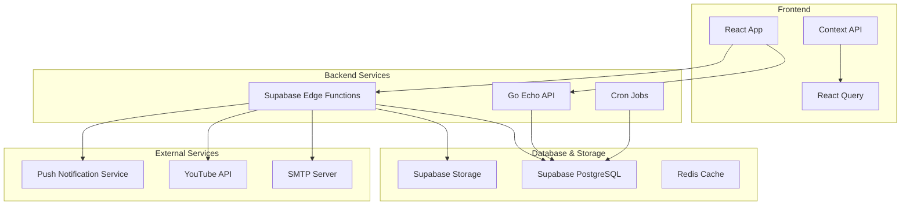

# Documento de Requerimientos - Integración Backend Sistema Sion

## 📋 Resumen Ejecutivo

Este documento detalla todos los requerimientos para la integración completa del backend del Sistema de Gestión Sion, basado en el análisis exhaustivo de la interfaz de usuario existente. El sistema actualmente opera con datos simulados y requiere una integración completa con servicios backend.

## 🏗️ Arquitectura Actual

### Frontend
- **Framework**: React + TypeScript + Vite
- **UI**: Tailwind CSS + Shadcn/ui
- **Estado**: Context API + React Query
- **Autenticación**: Supabase Auth
- **Routing**: React Router DOM

### Backend Existente
- **Database**: Supabase PostgreSQL
- **API**: Go Echo Server (parcialmente implementado)
- **Autenticación**: Supabase Auth + JWT
- **Files**: Supabase Storage (no configurado)

## 🎯 Módulos del Sistema

### 1. GESTIÓN DE USUARIOS Y AUTENTICACIÓN

#### 1.1 Autenticación y Autorización
**Estado Actual**: ✅ Parcialmente implementado
**Ubicación Frontend**: `src/pages/Login.tsx`, `src/pages/Register.tsx`

**Requerimientos Pendientes**:
- [ ] Implementar registro de usuarios completo con validación backend
- [ ] Sistema de verificación por email
- [ ] Recuperación de contraseñas
- [ ] Gestión de sesiones y tokens
- [ ] Middleware de autorización por roles

**Propuesta Técnica**:
```sql
-- Extender tabla de usuarios
ALTER TABLE public.users ADD COLUMN email_verified_at TIMESTAMP;
ALTER TABLE public.users ADD COLUMN password_reset_token TEXT;
ALTER TABLE public.users ADD COLUMN password_reset_expires TIMESTAMP;

-- Función para verificación de email
CREATE OR REPLACE FUNCTION verify_user_email(token TEXT)
RETURNS BOOLEAN AS $$
-- Implementar lógica de verificación
$$ LANGUAGE plpgsql SECURITY DEFINER;
```

#### 1.2 Gestión de Usuarios
**Estado Actual**: ⚠️ Usando datos mock
**Ubicación Frontend**: `src/pages/dashboard/UsersPage.tsx`, `src/pages/dashboard/RegisterUserPage.tsx`

**Funcionalidades Identificadas**:
- Listado de usuarios con paginación y filtros
- Crear nuevo usuario con formulario completo
- Editar información de usuario
- Activar/desactivar usuarios
- Búsqueda avanzada por múltiples campos
- Importación masiva desde Excel/CSV
- Exportación de datos

**APIs Requeridas**:
```go
// Endpoints necesarios
GET    /api/v1/users              // Listar usuarios con filtros
POST   /api/v1/users              // Crear usuario
GET    /api/v1/users/:id          // Obtener usuario específico
PUT    /api/v1/users/:id          // Actualizar usuario
DELETE /api/v1/users/:id          // Eliminar usuario
POST   /api/v1/users/import       // Importación masiva
GET    /api/v1/users/export       // Exportar usuarios
PATCH  /api/v1/users/:id/status   // Cambiar estado activo/inactivo
```

**Estructura de Base de Datos Adicional**:
```sql
-- Campos adicionales identificados en la UI
ALTER TABLE public.users ADD COLUMN IF NOT EXISTS profile_image_url TEXT;
ALTER TABLE public.users ADD COLUMN IF NOT EXISTS emergency_contact_name TEXT;
ALTER TABLE public.users ADD COLUMN IF NOT EXISTS emergency_contact_phone TEXT;
ALTER TABLE public.users ADD COLUMN IF NOT EXISTS notes TEXT;
ALTER TABLE public.users ADD COLUMN IF NOT EXISTS registration_source TEXT; -- web, admin, import
ALTER TABLE public.users ADD COLUMN IF NOT EXISTS last_login_at TIMESTAMP;

-- Índices para optimización
CREATE INDEX IF NOT EXISTS idx_users_email ON public.users(email);
CREATE INDEX IF NOT EXISTS idx_users_phone ON public.users(phone);
CREATE INDEX IF NOT EXISTS idx_users_role ON public.users(role);
CREATE INDEX IF NOT EXISTS idx_users_active ON public.users(is_active);
```

### 2. GESTIÓN DE EVENTOS

#### 2.1 Sistema de Eventos
**Estado Actual**: ❌ Completamente mock
**Ubicación Frontend**: `src/pages/dashboard/EventsPage.tsx`

**Funcionalidades Identificadas**:
- Crear eventos con categorías (Servicios, Conferencias, Adoración, Jóvenes, Niños, Comunitario)
- Programación de eventos recurrentes
- Gestión de capacidad y registro de asistentes
- Subir imágenes de eventos
- Publicar/despublicar eventos
- Compartir eventos
- Vista calendario
- Notificaciones de eventos

**Nueva Tabla Requerida**:
```sql
CREATE TABLE public.events (
    id UUID PRIMARY KEY DEFAULT gen_random_uuid(),
    title TEXT NOT NULL,
    description TEXT,
    category TEXT NOT NULL CHECK (category IN ('service', 'conference', 'worship', 'youth', 'children', 'community')),
    start_date DATE NOT NULL,
    start_time TIME NOT NULL,
    end_time TIME,
    location TEXT NOT NULL,
    max_attendees INTEGER,
    current_attendees INTEGER DEFAULT 0,
    is_published BOOLEAN DEFAULT false,
    is_recurring BOOLEAN DEFAULT false,
    recurrence_pattern JSONB, -- Para patrones de recurrencia
    requires_registration BOOLEAN DEFAULT false,
    image_url TEXT,
    organizer_id UUID REFERENCES public.users(id),
    created_by UUID REFERENCES public.users(id) NOT NULL,
    created_at TIMESTAMP WITH TIME ZONE DEFAULT NOW(),
    updated_at TIMESTAMP WITH TIME ZONE DEFAULT NOW()
);

-- Tabla para registros de asistencia
CREATE TABLE public.event_registrations (
    id UUID PRIMARY KEY DEFAULT gen_random_uuid(),
    event_id UUID REFERENCES public.events(id) ON DELETE CASCADE,
    user_id UUID REFERENCES public.users(id) ON DELETE CASCADE,
    registration_date TIMESTAMP WITH TIME ZONE DEFAULT NOW(),
    attendance_status TEXT DEFAULT 'registered' CHECK (attendance_status IN ('registered', 'attended', 'cancelled')),
    notes TEXT,
    UNIQUE(event_id, user_id)
);

-- RLS Policies
ALTER TABLE public.events ENABLE ROW LEVEL SECURITY;
CREATE POLICY "Events viewable by authenticated users" ON public.events FOR SELECT USING (auth.uid() IS NOT NULL);
CREATE POLICY "Events manageable by staff and above" ON public.events FOR ALL USING (
    EXISTS(SELECT 1 FROM public.users WHERE id = auth.uid() AND role IN ('pastor', 'staff'))
);
```

**APIs Requeridas**:
```go
GET    /api/v1/events                    // Listar eventos con filtros
POST   /api/v1/events                    // Crear evento
GET    /api/v1/events/:id                // Obtener evento específico
PUT    /api/v1/events/:id                // Actualizar evento
DELETE /api/v1/events/:id                // Eliminar evento
POST   /api/v1/events/:id/register       // Registrarse a evento
DELETE /api/v1/events/:id/register       // Cancelar registro
PATCH  /api/v1/events/:id/publish        // Publicar/despublicar
GET    /api/v1/events/calendar           // Vista calendario
POST   /api/v1/events/:id/image          // Subir imagen
```

### 3. SISTEMA DE REPORTES

#### 3.1 Generación de Reportes
**Estado Actual**: ❌ Completamente mock
**Ubicación Frontend**: `src/pages/dashboard/ReportsPage.tsx`

**Tipos de Reportes Identificados**:
1. **Reporte de Usuarios** - Estadísticas de miembros y visitantes
2. **Reporte de Crecimiento** - Análisis de crecimiento congregacional
3. **Reporte Demográfico** - Análisis por edades, ubicación y estados
4. **Reporte de Actividades** - Participación en eventos y servicios

**Funcionalidades**:
- Filtros por fecha personalizable
- Exportación en PDF, Excel, CSV
- Configuración de parámetros
- Programación de reportes automáticos
- Historial de reportes generados

**Nuevas Tablas Requeridas**:
```sql
-- Extender tabla reports existente
ALTER TABLE public.reports ADD COLUMN IF NOT EXISTS scheduled_frequency TEXT; -- daily, weekly, monthly, quarterly
ALTER TABLE public.reports ADD COLUMN IF NOT EXISTS recipients TEXT[]; -- emails para envío automático
ALTER TABLE public.reports ADD COLUMN IF NOT EXISTS next_generation TIMESTAMP;

-- Tabla para templates de reportes
CREATE TABLE public.report_templates (
    id UUID PRIMARY KEY DEFAULT gen_random_uuid(),
    name TEXT NOT NULL,
    report_type TEXT NOT NULL,
    template_config JSONB NOT NULL, -- Configuración del template
    is_active BOOLEAN DEFAULT true,
    created_by UUID REFERENCES public.users(id),
    created_at TIMESTAMP WITH TIME ZONE DEFAULT NOW()
);

-- Tabla para métricas del sistema
CREATE TABLE public.system_metrics (
    id UUID PRIMARY KEY DEFAULT gen_random_uuid(),
    metric_name TEXT NOT NULL,
    metric_value NUMERIC,
    metric_date DATE NOT NULL,
    metadata JSONB,
    created_at TIMESTAMP WITH TIME ZONE DEFAULT NOW()
);
```

**APIs Requeridas**:
```go
GET    /api/v1/reports                   // Listar reportes
POST   /api/v1/reports/generate          // Generar reporte
GET    /api/v1/reports/:id               // Obtener reporte específico
DELETE /api/v1/reports/:id               // Eliminar reporte
GET    /api/v1/reports/:id/download      // Descargar reporte
POST   /api/v1/reports/schedule          // Programar reporte automático
GET    /api/v1/reports/templates         // Obtener templates
POST   /api/v1/reports/templates         // Crear template
```

### 4. GESTIÓN DE ROLES Y PERMISOS

#### 4.1 Sistema de Roles
**Estado Actual**: ⚠️ Parcialmente implementado
**Ubicación Frontend**: `src/pages/dashboard/RoleManagementPage.tsx`

**Funcionalidades Identificadas**:
- Gestión de roles del sistema (Pastor, Staff, Supervisor, Server)
- Creación de roles personalizados
- Asignación granular de permisos
- Activar/desactivar roles personalizados
- Asignación masiva de roles

**Mejoras a la Base de Datos**:
```sql
-- Tabla para roles personalizados
CREATE TABLE public.custom_roles (
    id UUID PRIMARY KEY DEFAULT gen_random_uuid(),
    name TEXT NOT NULL UNIQUE,
    description TEXT,
    color TEXT DEFAULT '#3b82f6',
    is_active BOOLEAN DEFAULT true,
    created_by UUID REFERENCES public.users(id),
    created_at TIMESTAMP WITH TIME ZONE DEFAULT NOW(),
    updated_at TIMESTAMP WITH TIME ZONE DEFAULT NOW()
);

-- Tabla para permisos granulares
CREATE TABLE public.role_permission_matrix (
    id UUID PRIMARY KEY DEFAULT gen_random_uuid(),
    role_name TEXT NOT NULL, -- Puede ser system role o custom role
    resource TEXT NOT NULL, -- users, events, reports, etc.
    action TEXT NOT NULL, -- create, read, update, delete
    granted BOOLEAN DEFAULT false,
    UNIQUE(role_name, resource, action)
);
```

**APIs Requeridas**:
```go
GET    /api/v1/roles                     // Listar todos los roles
POST   /api/v1/roles                     // Crear rol personalizado
PUT    /api/v1/roles/:id                 // Actualizar rol
DELETE /api/v1/roles/:id                 // Eliminar rol personalizado
POST   /api/v1/roles/:id/permissions     // Asignar permisos
GET    /api/v1/roles/:id/users           // Usuarios con el rol
POST   /api/v1/users/:id/roles           // Asignar rol a usuario
```

### 5. CONFIGURACIÓN DEL SISTEMA

#### 5.1 Settings Management
**Estado Actual**: ❌ Completamente mock
**Ubicación Frontend**: `src/pages/dashboard/SettingsPage.tsx`

**Categorías de Configuración Identificadas**:
1. **General** - Configuración básica del sistema
2. **Iglesia** - Información de la congregación
3. **Notificaciones** - Email y push notifications
4. **Seguridad** - Políticas de seguridad
5. **Integraciones** - APIs externas
6. **Respaldos** - Configuración de backups

**Nueva Tabla Requerida**:
```sql
CREATE TABLE public.system_settings (
    id UUID PRIMARY KEY DEFAULT gen_random_uuid(),
    category TEXT NOT NULL, -- general, church, notifications, security, integrations, backup
    setting_key TEXT NOT NULL,
    setting_value JSONB,
    description TEXT,
    is_public BOOLEAN DEFAULT false, -- Si puede ser accedido sin autenticación
    updated_by UUID REFERENCES public.users(id),
    updated_at TIMESTAMP WITH TIME ZONE DEFAULT NOW(),
    UNIQUE(category, setting_key)
);

-- Configuraciones iniciales
INSERT INTO public.system_settings (category, setting_key, setting_value, description, is_public) VALUES
('general', 'system_name', '"Sistema Sion"', 'Nombre del sistema', true),
('general', 'timezone', '"America/Caracas"', 'Zona horaria del sistema', false),
('church', 'name', '"Iglesia Sion"', 'Nombre de la iglesia', true),
('church', 'address', '""', 'Dirección de la iglesia', true),
('notifications', 'smtp_host', '""', 'Servidor SMTP', false),
('security', 'session_timeout', '3600', 'Timeout de sesión en segundos', false);
```

**APIs Requeridas**:
```go
GET    /api/v1/settings                  // Obtener todas las configuraciones
GET    /api/v1/settings/:category        // Configuraciones por categoría
PUT    /api/v1/settings/:category/:key   // Actualizar configuración específica
POST   /api/v1/settings/backup           // Crear respaldo de configuración
POST   /api/v1/settings/restore          // Restaurar configuración
```

### 6. SISTEMA DE ARCHIVOS Y MULTIMEDIA

#### 6.1 Gestión de Archivos
**Estado Actual**: ❌ No implementado

**Requerimientos Identificados**:
- Subida de avatares de usuario
- Imágenes de eventos
- Logo de la iglesia
- Documentos adjuntos
- Exportación de reportes

**Configuración Supabase Storage**:
```sql
-- Crear buckets de almacenamiento
INSERT INTO storage.buckets (id, name, public) VALUES 
('avatars', 'avatars', true),
('events', 'events', true),
('documents', 'documents', false),
('reports', 'reports', false),
('system', 'system', true);

-- Políticas de storage
CREATE POLICY "Avatar images are publicly accessible" ON storage.objects FOR SELECT USING (bucket_id = 'avatars');
CREATE POLICY "Users can upload their own avatar" ON storage.objects FOR INSERT 
WITH CHECK (bucket_id = 'avatars' AND auth.uid()::text = (storage.foldername(name))[1]);

CREATE POLICY "Event images are publicly accessible" ON storage.objects FOR SELECT USING (bucket_id = 'events');
CREATE POLICY "Staff can manage event images" ON storage.objects FOR ALL USING (
    bucket_id = 'events' AND 
    EXISTS(SELECT 1 FROM public.users WHERE id = auth.uid() AND role IN ('pastor', 'staff'))
);
```

**APIs Requeridas**:
```go
POST   /api/v1/upload/avatar             // Subir avatar de usuario
POST   /api/v1/upload/event-image        // Subir imagen de evento
POST   /api/v1/upload/document           // Subir documento
DELETE /api/v1/files/:bucket/:path       // Eliminar archivo
GET    /api/v1/files/:bucket/:path       // Obtener archivo
```

### 7. STREAMING Y MULTIMEDIA

#### 7.1 Live Streaming
**Estado Actual**: ✅ Parcialmente implementado
**Ubicación Frontend**: `src/components/LiveStream.tsx`

**Funcionalidades Existentes**:
- Integración con YouTube Live
- Detección automática de streams activos
- Programación de próximos servicios

**Mejoras Requeridas**:
```sql
-- Extender tabla live_streams
ALTER TABLE public.live_streams ADD COLUMN IF NOT EXISTS thumbnail_url TEXT;
ALTER TABLE public.live_streams ADD COLUMN IF NOT EXISTS viewer_count INTEGER DEFAULT 0;
ALTER TABLE public.live_streams ADD COLUMN IF NOT EXISTS chat_enabled BOOLEAN DEFAULT true;
ALTER TABLE public.live_streams ADD COLUMN IF NOT EXISTS recording_url TEXT;

-- Tabla para estadísticas de streaming
CREATE TABLE public.streaming_analytics (
    id UUID PRIMARY KEY DEFAULT gen_random_uuid(),
    stream_id UUID REFERENCES public.live_streams(id),
    peak_viewers INTEGER,
    average_viewers INTEGER,
    total_watch_time INTEGER, -- en minutos
    engagement_rate DECIMAL(5,2),
    recorded_date DATE,
    created_at TIMESTAMP WITH TIME ZONE DEFAULT NOW()
);
```

**APIs Requeridas**:
```go
GET    /api/v1/streams                   // Listar streams
POST   /api/v1/streams                   // Crear nuevo stream
PUT    /api/v1/streams/:id               // Actualizar stream
PATCH  /api/v1/streams/:id/status        // Cambiar estado (live/offline)
GET    /api/v1/streams/analytics         // Obtener estadísticas
POST   /api/v1/streams/:id/webhook       // Webhook de YouTube
```

### 8. DASHBOARD Y ANALYTICS

#### 8.1 Dashboard Principal
**Estado Actual**: ⚠️ Parcialmente implementado
**Ubicación Frontend**: `src/pages/dashboard/DashboardHome.tsx`

**Métricas Identificadas**:
- Total de usuarios registrados
- Nuevos registros (últimos 7 días)
- Roles activos en el sistema
- Porcentaje de actividad del sistema
- Distribución de usuarios por rol
- Actividades recientes del sistema

**Mejoras Requeridas**:
```sql
-- Tabla para métricas diarias
CREATE TABLE public.daily_metrics (
    id UUID PRIMARY KEY DEFAULT gen_random_uuid(),
    metric_date DATE NOT NULL,
    total_users INTEGER DEFAULT 0,
    new_registrations INTEGER DEFAULT 0,
    active_users INTEGER DEFAULT 0, -- usuarios que iniciaron sesión
    events_count INTEGER DEFAULT 0,
    reports_generated INTEGER DEFAULT 0,
    system_uptime DECIMAL(5,2) DEFAULT 100.00,
    created_at TIMESTAMP WITH TIME ZONE DEFAULT NOW(),
    UNIQUE(metric_date)
);

-- Función para calcular métricas diarias
CREATE OR REPLACE FUNCTION calculate_daily_metrics(target_date DATE)
RETURNS VOID AS $$
BEGIN
    INSERT INTO public.daily_metrics (metric_date, total_users, new_registrations)
    VALUES (
        target_date,
        (SELECT COUNT(*) FROM public.users WHERE is_active = true),
        (SELECT COUNT(*) FROM public.users WHERE DATE(created_at) = target_date)
    )
    ON CONFLICT (metric_date) DO UPDATE SET
        total_users = EXCLUDED.total_users,
        new_registrations = EXCLUDED.new_registrations,
        created_at = NOW();
END;
$$ LANGUAGE plpgsql SECURITY DEFINER;
```

**APIs Requeridas**:
```go
GET    /api/v1/dashboard/stats           // Estadísticas principales
GET    /api/v1/dashboard/metrics         // Métricas históricas
GET    /api/v1/dashboard/activity        // Actividad reciente
GET    /api/v1/dashboard/distribution    // Distribución de roles
```

## 🔧 Infraestructura y Servicios Adicionales

### 9.1 Sistema de Notificaciones
**Requerimiento**: Implementar notificaciones por email y push

**Servicios Necesarios**:
```sql
CREATE TABLE public.notification_templates (
    id UUID PRIMARY KEY DEFAULT gen_random_uuid(),
    name TEXT NOT NULL,
    type TEXT NOT NULL, -- email, push, sms
    subject TEXT,
    body_template TEXT NOT NULL,
    variables JSONB, -- Variables disponibles en el template
    is_active BOOLEAN DEFAULT true,
    created_at TIMESTAMP WITH TIME ZONE DEFAULT NOW()
);

CREATE TABLE public.notification_queue (
    id UUID PRIMARY KEY DEFAULT gen_random_uuid(),
    recipient_id UUID REFERENCES public.users(id),
    template_id UUID REFERENCES public.notification_templates(id),
    variables JSONB,
    status TEXT DEFAULT 'pending', -- pending, sent, failed
    sent_at TIMESTAMP,
    error_message TEXT,
    created_at TIMESTAMP WITH TIME ZONE DEFAULT NOW()
);
```

**Edge Functions Requeridas**:
- `send-email`: Envío de emails via SMTP
- `send-push-notification`: Notificaciones push
- `process-notification-queue`: Procesamiento de cola

### 9.2 Sistema de Auditoría Extendido
**Estado Actual**: ✅ Básico implementado

**Mejoras Requeridas**:
```sql
-- Extender audit_logs para más contexto
ALTER TABLE public.audit_logs ADD COLUMN IF NOT EXISTS ip_address INET;
ALTER TABLE public.audit_logs ADD COLUMN IF NOT EXISTS user_agent TEXT;
ALTER TABLE public.audit_logs ADD COLUMN IF NOT EXISTS session_id TEXT;

-- Tabla para eventos de seguridad
CREATE TABLE public.security_events (
    id UUID PRIMARY KEY DEFAULT gen_random_uuid(),
    event_type TEXT NOT NULL, -- login_failed, password_changed, role_changed, etc.
    user_id UUID REFERENCES public.users(id),
    ip_address INET,
    user_agent TEXT,
    details JSONB,
    risk_level TEXT DEFAULT 'low', -- low, medium, high
    created_at TIMESTAMP WITH TIME ZONE DEFAULT NOW()
);
```

### 9.3 Jobs y Tareas Programadas
**Requerimiento**: Tareas automáticas del sistema

**Edge Functions para Cron Jobs**:
- `daily-metrics-calculation`: Cálculo diario de métricas
- `cleanup-old-files`: Limpieza de archivos antiguos
- `send-scheduled-reports`: Envío de reportes programados
- `backup-database`: Respaldos automáticos
- `update-streaming-stats`: Actualización de estadísticas de streaming

## 📊 Diagramas de Arquitectura

### Diagrama de Base de Datos



### Diagrama de Flujo de Autenticación



### Diagrama de Arquitectura del Sistema



## 🚀 Plan de Implementación

### Fase 1: Fundamentos (Semanas 1-2)
1. **Completar autenticación y autorización**
2. **Implementar gestión básica de usuarios**
3. **Configurar sistema de archivos**
4. **Establecer system settings básicos**

### Fase 2: Funcionalidades Core (Semanas 3-4)
1. **Sistema completo de eventos**
2. **Dashboard con métricas reales**
3. **Gestión de roles avanzada**
4. **Sistema básico de notificaciones**

### Fase 3: Reportes y Analytics (Semanas 5-6)
1. **Generación de reportes**
2. **Sistema de métricas avanzado**
3. **Exportación de datos**
4. **Programación de tareas automáticas**

### Fase 4: Optimización y Extras (Semana 7)
1. **Sistema de auditoría extendido**
2. **Optimización de performance**
3. **Testing completo**
4. **Documentación final**

## ✅ Criterios de Aceptación

Cada funcionalidad debe cumplir con:
1. **Seguridad**: RLS policies correctamente implementadas
2. **Performance**: Respuestas < 500ms para operaciones normales
3. **Validación**: Validación tanto en frontend como backend
4. **Auditoría**: Todas las acciones críticas deben quedar registradas
5. **Testing**: Cobertura mínima del 80% en backend APIs
6. **Documentación**: APIs documentadas con OpenAPI/Swagger

---

**Total Estimado**: 7 semanas de desarrollo para un equipo de 2-3 desarrolladores

**Prioridad Alta**: Autenticación, Usuarios, Eventos, Dashboard
**Prioridad Media**: Reportes, Configuraciones, Notificaciones  
**Prioridad Baja**: Analytics avanzados, Optimizaciones