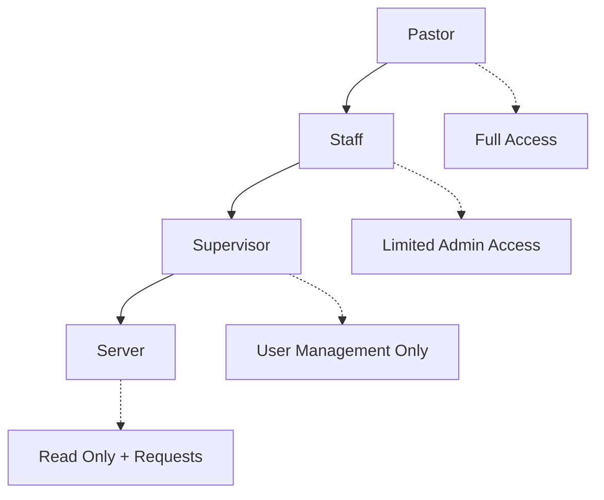

# Database Architecture - Sion Church Management System

## Overview
The Sion project uses a secure, role-based architecture with comprehensive audit logging and hierarchical permissions. All database structures use English naming for international scalability.

## User Roles Hierarchy



### Role Permissions

| Role | Can View | Can Edit | Can Delete | Can Generate Reports |
|------|----------|----------|------------|---------------------|
| **Pastor** | All users | All users | All except pastor | ✅ Yes |
| **Staff** | All non-pastors | All non-pastor/staff | All non-pastor/staff | ✅ Yes |
| **Supervisor** | Supervisors & servers | Supervisors & servers | Only servers | ❌ No |
| **Server** | Own data only | Own data only | None | ❌ No |

## Database Schema

### Core Tables

#### `users` Table
Primary user information with extended fields for comprehensive member tracking.

```sql
CREATE TABLE public.users (
  id UUID PRIMARY KEY DEFAULT gen_random_uuid(),
  -- Authentication fields
  correo TEXT NOT NULL,
  password_hash TEXT NOT NULL,
  
  -- Basic info
  nombres TEXT NOT NULL,
  apellidos TEXT NOT NULL,
  cedula TEXT NOT NULL UNIQUE,
  telefono TEXT NOT NULL,
  direccion TEXT NOT NULL,
  
  -- Extended member tracking
  birth_date DATE,
  marital_status TEXT,
  occupation TEXT,
  education_level TEXT,
  how_found_church TEXT,
  ministry_interest TEXT,
  first_visit_date DATE,
  
  -- Church membership
  bautizado BOOLEAN DEFAULT false,
  fecha_bautizo TIMESTAMP,
  is_active_member BOOLEAN DEFAULT false,
  membership_date DATE,
  
  -- Cell group management
  cell_group TEXT,
  cell_leader_id UUID REFERENCES users(id),
  
  -- Role and admin fields
  role user_role DEFAULT 'server',
  pastoral_notes TEXT,
  is_active BOOLEAN DEFAULT true,
  whatsapp BOOLEAN DEFAULT false,
  
  -- Timestamps
  created_at TIMESTAMP WITH TIME ZONE DEFAULT NOW(),
  updated_at TIMESTAMP WITH TIME ZONE DEFAULT NOW()
);
```

#### `user_permissions` Table
Granular permission management system.

```sql
CREATE TABLE public.user_permissions (
  id UUID PRIMARY KEY DEFAULT gen_random_uuid(),
  user_id UUID NOT NULL REFERENCES users(id) ON DELETE CASCADE,
  permission_name TEXT NOT NULL,
  resource TEXT NOT NULL, -- 'users', 'reports', 'livestreams'
  action TEXT NOT NULL,   -- 'create', 'read', 'update', 'delete'
  granted BOOLEAN DEFAULT true,
  granted_by UUID REFERENCES users(id),
  created_at TIMESTAMP WITH TIME ZONE DEFAULT NOW(),
  updated_at TIMESTAMP WITH TIME ZONE DEFAULT NOW(),
  UNIQUE(user_id, permission_name, resource, action)
);
```

#### `audit_logs` Table
Complete audit trail for all user modifications.

```sql
CREATE TABLE public.audit_logs (
  id UUID PRIMARY KEY DEFAULT gen_random_uuid(),
  table_name TEXT NOT NULL,
  record_id UUID NOT NULL,
  action TEXT NOT NULL, -- 'INSERT', 'UPDATE', 'DELETE'
  old_values JSONB,
  new_values JSONB,
  changed_by UUID REFERENCES users(id),
  changed_at TIMESTAMP WITH TIME ZONE DEFAULT NOW()
);
```

#### `reports` Table
Track report generation for administrative oversight.

```sql
CREATE TABLE public.reports (
  id UUID PRIMARY KEY DEFAULT gen_random_uuid(),
  title TEXT NOT NULL,
  type TEXT NOT NULL, -- 'user_summary', 'attendance', 'membership'
  parameters JSONB,
  generated_by UUID NOT NULL REFERENCES users(id),
  generated_at TIMESTAMP WITH TIME ZONE DEFAULT NOW(),
  file_url TEXT,
  status TEXT DEFAULT 'pending' -- 'pending', 'completed', 'failed'
);
```

## Security Features

### Row Level Security (RLS)
All tables implement comprehensive RLS policies:

- **Hierarchical Access**: Higher roles can access subordinate data
- **Self-Management**: Users can always access their own data
- **Pastor Protection**: Pastor accounts cannot be deleted
- **Audit Security**: Only pastors and staff can view audit logs

### Automatic Audit Logging
The `log_user_changes()` trigger function automatically tracks:
- All INSERT, UPDATE, DELETE operations on users
- Complete before/after state capture in JSONB
- Timestamp and user attribution

### Data Validation
- English field names for international compatibility
- Indexed fields for performance (birth_date, cell_leader, is_active)
- Foreign key constraints for data integrity
- Unique constraints preventing duplicate permissions

## API Integration

### Frontend Integration
- **React Context**: Role-based UI rendering
- **Protected Routes**: Component-level permission checking
- **Real-time Updates**: Supabase subscriptions for live data

### Backend Integration
- **Go Echo Server**: RESTful API with middleware authentication
- **Supabase Client**: Direct database operations with RLS
- **Permission Middleware**: Route-level authorization

## Testing Strategy

### Unit Tests Required
- [ ] Role hierarchy validation
- [ ] Permission checking functions
- [ ] Audit logging triggers
- [ ] RLS policy enforcement
- [ ] Data validation constraints

### Integration Tests Required
- [ ] User authentication flow
- [ ] Role-based data access
- [ ] Report generation process
- [ ] Audit trail verification
- [ ] Cell leader assignment

## Development Guidelines

### Code Standards
- **Language**: All code, comments, and documentation in English
- **Testing**: Minimum 80% test coverage for security-critical functions
- **Naming**: Consistent camelCase for TypeScript, snake_case for SQL
- **Validation**: Client and server-side validation for all inputs

### Security Considerations
- Never expose user passwords or sensitive data in logs
- Always validate user permissions before data operations
- Use parameterized queries to prevent SQL injection
- Implement rate limiting for API endpoints
- Regular security audits and penetration testing

## Monitoring and Observability

### Required Metrics
- User role distribution
- Permission changes audit
- Failed authentication attempts
- Database query performance
- Report generation frequency

### Alerting
- Suspicious permission changes
- Failed login attempts above threshold
- Database performance degradation
- Unauthorized access attempts

## Migration Strategy

### Database Migrations
- Use Supabase migration tool for all schema changes
- Test migrations in staging environment first
- Backup data before major structural changes
- Document all migration steps and rollback procedures

### Data Migration
- Preserve existing user data during role transitions
- Validate data integrity after migrations
- Update application code to match new schema
- Coordinate frontend and backend deployments